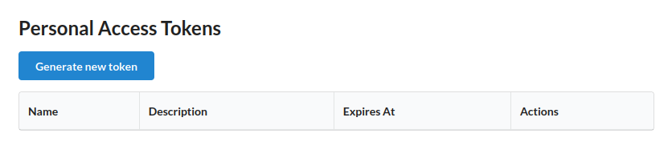
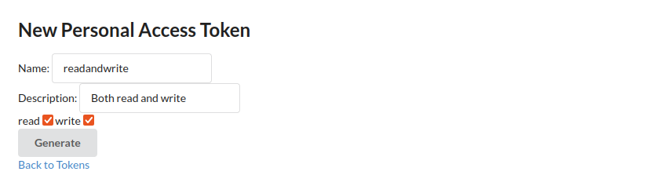
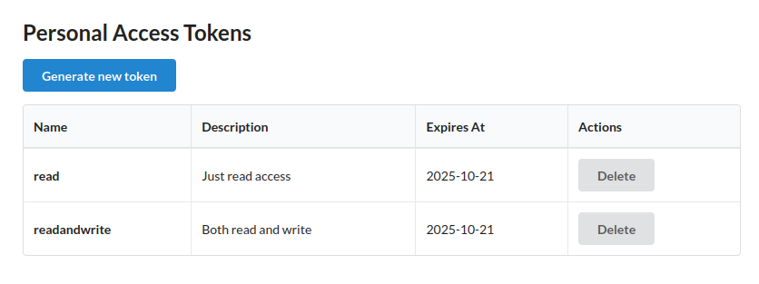

# Spring Security PAT

This project introduces Personal Access Token (PAT) support as an extension to both `spring-security` and `spring-authorization-server`. This is experimental code and there's no plans to publish this into maven central.

Modules in this project:

- `spring-security-pat`: _Spring Security Pat_ extension
- `spring-security-pat-authorization-server`: _Spring Security Authorization Server Pat_ extension
- `spring-security-pat-autoconfigure`: _Spring Security Boot_ Auto-Configuration.
- `sample/idserver`: _Spring Authorization Server_ sample.
- `sample/apiserver`: _API Server_ sample.
- `sample/common`: _Shared Classes_ and _Configurations_ for _idserver_ and _apiserver_.

**Quick Start:**
Jump to the end of this README to learn how to compile and run the sample applications. You’ll see how to protect API endpoints using PATs.

State:
- Missing a lot of tests(in progress)
- Some cleanup/polishing to do
- Configuration DSL's not yet stable

## Introduction

Modern authentication systems frequently use OAuth2, but its complexity can be excessive for simple scenarios—such as authenticating API access for users or services. The lack of a widely adopted standard for straightforward token-based API authentication has resulted in a fragmented ecosystem, with each API often implementing its own approach. This project aims to establish a consistent and practical standard for Personal Access Token authentication, particularly for users of Spring Security.

This project aims to:

- Provide a general-purpose, Spring-based framework for Personal Access Token authentication.
- Work seamlessly with or without `spring-authorization-server`.
- Remain agnostic to the specific token format.
- Offer flexible key generation strategies for different use cases.

## Spring Security

This section explains how to use PATs with `spring-security`.

Before configuring PAT integration, it's helpful to understand the core concepts involved:

### PatAuthorizationService
Defines the interface responsible for storing and retrieving tokens, mapping each `PatAuthorization` to its corresponding token. Currently, there is an in-memory implementation (`InMemoryPatAuthorizationService`) and a jdbc implementation (`JdbcPatAuthorizationService`) provided.

### PatGenerator
An interface responsible for generating tokens from arbitrary input. For more details, see the PAT Generation section below.

### PatMatcher
An interface for quickly matching tokens, allowing the framework to efficiently filter out obvious invalid tokens before performing more expensive validation checks. This helps reduce unnecessary processing by discarding tokens that are clearly not valid at an early stage.

### PatService
A simple interface that combines a `PatGenerator` and a `PatMatcher`. A dedicated implementation of `PatService` will provide both interfaces.

### PatAuthenticatedPrincipal
A `PatAuthenticatedPrincipal` is a Spring Security's `AuthenticatedPrincipal` adding info about a principal and granted authorities.

### PatIntrospector
An interface responsible to _introspect_ a `token` and return a `PatAuthenticatedPrincipal`. We have two built-in implementations, `SpringAuthServerPatIntrospector` and `PatAuthorizationServicePatIntrospector` where former is used with an `spring-authorization-server` and latter without it.

### Configuration Example

There are two primary configuration scenarios: one using `spring-authorization-server` and one without it. The key distinction is that, without an authorization server, token introspection is handled locally via the configured `PatAuthorizationService`. When using `spring-authorization-server`, introspection is delegated to the authorization server
using `SpringAuthServerPatIntrospector`.

#### Without `spring-authorization-server`

Enable PAT integration with the default configuration. Default configuration will use an empty instance of a `InMemoryPatAuthorizationService`.

```java
import com.github.jvalkeal.secpat.pat.PatConfigurer;
import static org.springframework.security.config.Customizer.withDefaults;

public SecurityFilterChain filterChain1(HttpSecurity http) throws Exception {
    http.with(PatConfigurer.dsl(), withDefaults());
    return http.build();
}
```

This default configuration gets you past the configuration phase but it may
be useless unless you have added your own `PatAuthorizationService`. In an
absense of a `PatAuthorizationService` a default instance of a `InMemoryPatAuthorizationService`
will be created which will be empty. Thus it will be useless unless you
postprocess that service and add you own users.

#### With `spring-authorization-server`

If you have a `spring-authorization-server` suppoting Pat Introspection you enable support to delegate introspection into it.

Enable PAT integration with the default configuration.

```java
import com.github.jvalkeal.secpat.pat.PatConfigurer;
import static org.springframework.security.config.Customizer.withDefaults;

public SecurityFilterChain filterChain1(HttpSecurity http) throws Exception {
    http.with(PatConfigurer.dsl(), pat -> {
        pat.endpointIntrospection(withDefaults());
    });
    return http.build();
}
```

Defining an intospection endpoint will configure introspection to happen on
a remote server instead locally on a server.

#### Customizing PatIntrospector

To fully define your own `PatIntrospector` there's an a method for that:

```java
import com.github.jvalkeal.secpat.pat.PatConfigurer;
import com.github.jvalkeal.secpat.pat.introspect.PatIntrospector;

public SecurityFilterChain filterChain1(HttpSecurity http) throws Exception {
    PatIntrospector patIntrospector = create();
    http.with(PatConfigurer.dsl(), pat -> {
        pat.introspector(patIntrospector);
    });
    return http.build();
}

```

## Spring Authorization Server

While you can use the PAT framework directly with `spring-security`, this can introduce unnecessary complexity — especially in distributed environments where token storage must be centralized. In many cases, it is more convenient to use an Authorization Server, which provides a dedicated API for token verification.

### Introspection Endpoint

The PAT Token Introspection Endpoint works similarly to OAuth2’s introspection endpoint.

The introspection endpoint is a PAT endpoint that takes a parameter representing an PAT token and returns a JSON document representing the meta information surrounding the token, including whether this token is currently active.

The introspection endpoint MUST be protected by a transport-layer security mechanism such as it is protected by an OAuth intospection endpoint in the spesification.

> **_NOTE:_**  It probably doesn't make sense to come up with PAT related spesification to protect endpoint and thus we should assume endpoint can be protected with same way than OAuth own introspection endpoint is protected. Essentially out of scope for this spec.

#### Introspection Request

The protected resource calls the introspection endpoint using an HTTP POST request with parameters sent as "application/x-www-form-urlencoded". The protected resource sends a parameter representing the token along with optional parameters representing additional context that is known by the protected resource to aid the authorization server in its response.

- `token` **REQUIRED**: The PAT string to be introspected.
- `token_principal` **OPTIONAL**: A hint identifying the principal associated with the token. Providing this can help the authorization server efficiently locate the token and may reduce the risk of token enumeration attacks. The authorization server may require this parameter.

For example, the following shows a protected resource calling the token introspection endpoint to query about a PAT token. The protected resource is using a separate OAuth bearer token to authorize this call.

```
POST /pat/introspect HTTP/1.1
Host: server.example.com
Accept: application/json
Content-Type: application/x-www-form-urlencoded
Authorization: Bearer <oauthbearertoken>

token=mytoken
```

In this example, the protected resource uses a client identifier and client secret to authenticate itself to the introspection endpoint. The protected resource also sends a token principal indicating that it is inquiring about a PAT.

```
POST /pat/introspect HTTP/1.1
Host: server.example.com
Accept: application/json
Content-Type: application/x-www-form-urlencoded
Authorization: Basic <basicauth>

token=mytoken&token_principal=user1
```
#### Introspection Response

The server responds with a JSON object in "application/json" format with the following top-level members.

- `active` **REQUIRED**: Boolean indicator of whether or not the presented token is currently active.
- `scope` **OPTIONAL**: A JSON array containing a list of scopes associated with this token.
- `exp` **OPTIONAL**: Integer timestamp, measured in the number of seconds since January 1 1970 UTC, indicating when this token will expire.
- `iat` **OPTIONAL**: Integer timestamp, measured in the number of seconds since January 1 1970 UTC, indicating when this token was originally issued.
- `nbf` **OPTIONAL**: Integer timestamp, measured in the number of seconds since January 1 1970 UTC, indicating when this token is not to be used before.
- `username` **OPTIONAL**: Human-readable identifier for the resource owner who authorized this token.

> **_NOTE:_**  While `active` is the only field required as it's either _true_ or _false_, other fields become sort of a required when `active` is _true_.

The following is a non-normative example response.

```json
HTTP/1.1 200 OK
Content-Type: application/json

{
    "active": true,
    "exp": 1759841931.3023574,
    "iat": 1757249931.3023574,
    "nbf": 1757249931.3023574,
    "scope": [
        "read"
    ],
    "username": "john"
}
```

The following is a non-normative example response for a token that has been revoked or is otherwise invalid.

```json
HTTP/1.1 200 OK
Content-Type: application/json

{
    "active": false
}
```

### Configuration Example

```java
import static org.springframework.security.config.Customizer.withDefaults;

public SecurityFilterChain authorizationServerSecurityFilterChain(HttpSecurity http) throws Exception {
	OAuth2AuthorizationServerConfigurer authorizationServerConfigurer =
			OAuth2AuthorizationServerConfigurer.authorizationServer();
	http.with(authorizationServerConfigurer, withDefaults());
	http.authorizeHttpRequests((authorize) -> authorize.anyRequest().authenticated());
	http.getConfigurer(OAuth2AuthorizationServerConfigurer.class).oidc(withDefaults());

	// Add pat configuration to authz server
	PatAuthorizationServerConfigurer patAuthorizationServerConfigurer = PatAuthorizationServerConfigurer.dsl();
	http
		.with(patAuthorizationServerConfigurer, pat -> {
			pat.patAuthorizationServerSettings(PatAuthorizationServerSettings.builder().build());
			pat.tokenIntrospectionEndpoint(withDefaults());
	});

	// Only extension point to sneak in pat endpoint together with other authz endpoints
	// http.securityMatcher(authorizationServerConfigurer.getEndpointsMatcher());
	http.securityMatchers(matchers -> {
		matchers.requestMatchers(
			authorizationServerConfigurer.getEndpointsMatcher(),
			patAuthorizationServerConfigurer.getEndpointsMatcher()
		);
	});

	http
		.exceptionHandling((exceptions) -> exceptions
			.defaultAuthenticationEntryPointFor(
				new LoginUrlAuthenticationEntryPoint("/login"),
				new MediaTypeRequestMatcher(MediaType.TEXT_HTML)
			)
		)
		.oauth2ResourceServer((resourceServer) -> resourceServer.jwt(withDefaults()));
	return http.build();
}
```

## Common Concepts

This section covers general concepts and best practices for PAT authentication.

### PAT Format

The format of an API key or PAT is often influenced by both security and business requirements. Here are some key considerations:

- **Randomness:** Every token should include a sufficiently random component to ensure security.
- **Additional Data:** Tokens may include identifiers for debugging or operational purposes.
- **Entropy:** The strength of a token is measured by its entropy. For reference:
  - 1–25 bits: Poor
  - 26–50 bits: Weak
  - 51–75 bits: Reasonable
  - 76–100 bits: Good
  - 100+ bits: Excellent
  - 128+ bits: Required by standards such as ANSSI R18 and NIST SP 800-90A/57

  For example, a Java UUID (e.g., `5fc94f59-3386-4b91-bf57-80e62138166a`) has 128 bits, but due to some fixed bits, its effective entropy is about 122 bits.

- **Embedded Data:** For debugging or support, you may want to embed information in the token, such as a Base64URL-encoded JSON object.
- **Secret Scanning:** If you plan to implement secret scanning, design your token format to be easily recognizable and scannable.
- **Usability:** Consider how users will interact with tokens. For example, using underscores (`my_snake_token`) instead of hyphens (`my-kebab-token`) can make it easier to select the entire token with a double-click.

### PAT Generation

This section describes a built-in features for a token generation.

#### Default Generator

The default PAT generator uses Java's UUID, offering a strong baseline of security and randomness. While this is a sensible default for many scenarios, it may not address specific business requirements such as custom token formats, embedded metadata, scannability, or enhanced usability.

#### Prefixed Generator

The `OrgTypeChecksumBase62PatGenerationService` offers a more structured approach to token generation. It creates tokens that include organization and type prefixes, a checksum, and Base62 encoding. This design reduces collision risk, enhances token recognition, and supports traceability. Because it requires specifying both an `org` and a `type`, it is ideal for environments where token structure and auditability are important. We don't want to provide default values for `org` and a `type`, thus for this reason, it is not the default generator.

A typical token generated by this service might look like:
> `myorg_mytype_2amCHC_irKL0Yf8csrzUXr3r3KHiniCvIBOy55BYm5aWJoazfLo20fGdZm`

Optionally, a `version` field can be appended, resulting in a token such as:
> `myorg_mytype_2amCHC_irKL0Yf8csrzUXr3r3KHiniCvIBOy55BYm5aWJoazfLo20fGdZm_v1`

Including fields like `version` enables advanced business controls, such as key rotation policies. For example, with a `version` field, you could enforce a maximum key validity of six months and increment the version annually. This approach allows you to invalidate older keys efficiently and filter out false positives before querying your token storage.

## Sample Applications

This repository includes sample applications:

- **ApiServer:** Demonstrates API endpoints protected by PATs.
- **IdServer:** Provides a minimal configuration for both OIDC and PAT, showing how they can work together.

The API server includes endpoints that illustrate the differences between browser-based and command-line client requests.

> **_IMPORTANT:_**  These samples are configured to use hostnames `idserver` and `apiserver` to work around issues with _JSESSIONID_ cookie not get mangled with servers as browser cookies are bound to hostnames thus using `localhost` for both would not work.

Have something like this in your _hosts_ file:

```
127.0.0.1	localhost idserver apiserver
```

Profiles:

- **authserver:** `apiserver` will introspect with the authorization server
- **patsfromyml:** Users are defined in the YAML configuration under this profile
- **patsfromjava:** Users are defined in the shared Java configuration under this profile
- **postgres:** Users are stored in a database

There are 3 different scenarios these samples can demonstrate.

> **_NOTE:_**  In all samples we need _Authorization Server_ as _Api Server_ has `OICD` configured even if _Pat Authentication_ doesn't use _Authorization Server_.

Before you continue, compile a project:

```
./gradlew build
```
> **_NOTE:_**  _Authorization Server_ have two users defined those being `user` and `admin` both having password set to `password`.

### Pat Authentication done without Authorization Server

In this sample a pat users are defined via properties using _auto-configuration_:

```yml
spring:
  security:
    pat:
      pats:
      - principal: user1
        token: pat1111
        scopes:
        - read
        issued-at: 1735603200000    # Tuesday, 31 December 2024 00:00:00
        expires-at: 1767139200000   # Wednesday, 31 December 2025 00:00:00
        not-before: 1735603200000   # Tuesday, 31 December 2024 00:00:00
```

Start _Id Server_:

```
java -jar \
  sample/idserver/build/libs/idserver-0.0.1-SNAPSHOT.jar \
  --spring.profiles.active=patsfromyml
```

Start _API Server_:

```
java -jar \
  sample/apiserver/build/libs/apiserver-0.0.1-SNAPSHOT.jar \
  --spring.profiles.active=patsfromyml
```

Issue command-line request:

```
http --body GET localhost:8080/api/whoami/principal 'X-PAT:pat1111'

Principal class: class com.github.jvalkeal.secpat.pat.PatTokenAuthenticationToken
User: user1
Scopes: read
```


### Pat Authentication done with Authorization Server

In this example we have configured `Api Server` to delegate token instrospection into an `Authorization Server` having same user configuration as in a previous example:

Start _Id Server_:

```
java -jar \
  sample/idserver/build/libs/idserver-0.0.1-SNAPSHOT.jar \
  --spring.profiles.active=patsfromyml
```

Start _API Server_:

```
java -jar \
  sample/apiserver/build/libs/apiserver-0.0.1-SNAPSHOT.jar \
  --spring.profiles.active=authserver
```

Issue command-line request:

```
http --body GET localhost:8080/api/whoami/principal 'X-PAT:pat1111'

Principal class: class com.github.jvalkeal.secpat.pat.PatTokenAuthenticationToken
User: user1
Scopes: read
```

### Complete sample with PostgreSQL and Authorization Server

This is a more complate example using a `postgresql` database. _Api Server_ and _Id Server_ are configured to use _JdbcPatAuthorizationService_ as a backend.

With this sample we're expect existing local instance of a `postgresql` running with _user_ `postgres`, _password `postegres` and database name `spring`. For example with docker:

```
docker run --name postgres -p "5432:5432" -e POSTGRES_DB=spring -e POSTGRES_USER=postgres -e POSTGRES_PASSWORD=postgres -d postgres
```

Start _Id Server_:

```
java -jar \
  sample/idserver/build/libs/idserver-0.0.1-SNAPSHOT.jar \
  --spring.profiles.active=postgres
```

Start _Api Server_:

```
java -jar \
  sample/apiserver/build/libs/apiserver-0.0.1-SNAPSHOT.jar \
  --spring.profiles.active=authserver,postgres
```

Go to http://apiserver:8080/user/pats, login and and create your Personal Access Tokens. These screenshots shows the process:

Generate a new token:



You need to give a name and optionally select scopes(read and write):


Copy your token as it's a last time we show it to you:


You can choose more scopes:



You can see tokens you have and delete the ones you don't need anymore:



For example to use a generated PAT from a command line:

```
http --body GET localhost:8080/api/whoami/principal 'X-PAT:7c5ab093-8989-4e63-8e85-4cd86f92361d'

Principal class: class com.github.jvalkeal.secpat.pat.PatTokenAuthenticationToken
User: user
Scopes: SCOPE_read
```
